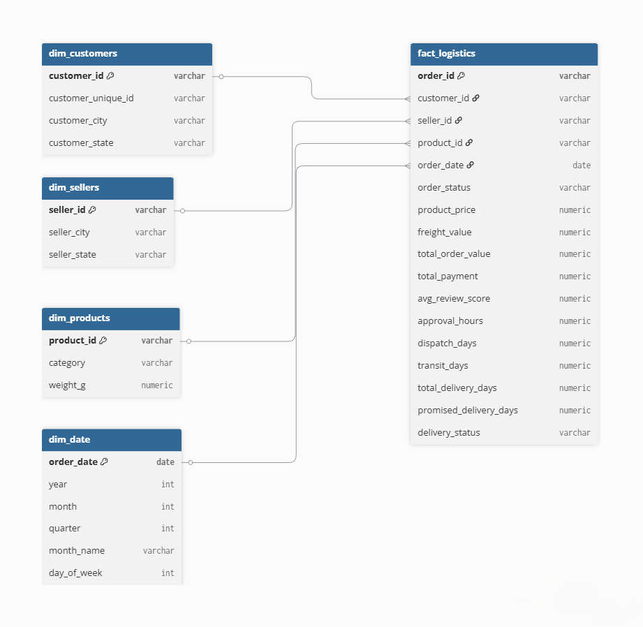

# Olist Logistics Intelligence Warehouse

A Medallion SQL Data Warehouse built on **100,000+ real Brazilian e-commerce orders** from the Olist platform (2016–2018).

This project focuses entirely on **logistics and supply chain performance** — not retail sales. Key business questions answered include:

* Which seller states breach SLAs most?
* Does late delivery reduce customer ratings?
* Which regions experience the longest delivery timelines?
* How do freight costs vary across product categories?
* Which sellers outperform peers operationally?

Built purely in **PostgreSQL** with **no BI tools**, demonstrating SQL depth across **warehouse architecture, data cleaning, star schema design, and advanced analytics**.

---

## Project Highlights

* Built a **Bronze → Silver → Gold Medallion warehouse** in PostgreSQL
* Designed an **analytics-ready Star Schema** (4 dimensions + 1 fact table)
* Processed **100K+ real e-commerce logistics records**
* Developed **10 advanced SQL analyses** using window functions, CTEs, ranking, rolling averages, and SLA analytics
* Created reusable reporting views for **seller performance** and **monthly logistics KPIs**
* Focused analysis on **logistics intelligence**, not retail revenue

---

## Architecture — Medallion (Bronze → Silver → Gold)

```text
RAW CSV FILES (9 datasets, 100K+ records)
            ↓
      BRONZE LAYER
Raw data loaded as-is with no transformations.
Timestamps stored as VARCHAR to prevent load errors.
            ↓
       SILVER LAYER
Cleaned and typed data.
VARCHAR → TIMESTAMP casts, NULL handling,
city/state standardization, Portuguese → English
category translation, payments collapsed to one row per order.
            ↓
        GOLD LAYER
Analytics-ready Star Schema.
4 dimension tables + 1 central fact table with
computed logistics metrics and SLA flags.
            ↓
         ANALYTICS
10 advanced SQL queries + 2 reporting views
```

---

## Star Schema Design



**`gold.fact_logistics`** is the central fact table.

Each row represents **one order** and contains computed logistics metrics:

* `approval_hours` → time from purchase to order approval
* `dispatch_days` → time from approval to courier pickup
* `transit_days` → time spent in transit
* `total_delivery_days` → end-to-end purchase to doorstep
* `promised_delivery_days` → expected customer delivery time
* `delivery_status` → `On Time` / `Late` / `Not Delivered`

---

## Dataset

**Source:** Olist Brazilian E-Commerce Public Dataset (Kaggle)

Dataset link:

https://www.kaggle.com/datasets/olistbr/brazilian-ecommerce

| File                                  | Rows    | Description                  |
| ------------------------------------- | ------- | ---------------------------- |
| olist_orders_dataset.csv              | 99,441  | Core order records           |
| olist_order_items_dataset.csv         | 112,650 | Items per order              |
| olist_customers_dataset.csv           | 99,441  | Customer details             |
| olist_sellers_dataset.csv             | 3,095   | Seller details               |
| olist_products_dataset.csv            | 32,951  | Product catalog              |
| olist_order_payments_dataset.csv      | 103,886 | Payment records              |
| olist_order_reviews_dataset.csv       | 99,224  | Customer reviews             |
| product_category_name_translation.csv | 71      | Portuguese → English mapping |

**Excluded Dataset:** `olist_geolocation_dataset.csv`
Geographic coordinate data was intentionally excluded to keep the project focused on **SQL-based logistics intelligence**.

---

## Dataset Setup

The raw dataset is **not included** in this repository.

Download the public dataset from Kaggle and place the CSV files inside:

```text
datasets/raw/
```

Expected files:

* `olist_orders_dataset.csv`
* `olist_order_items_dataset.csv`
* `olist_customers_dataset.csv`
* `olist_sellers_dataset.csv`
* `olist_products_dataset.csv`
* `olist_order_payments_dataset.csv`
* `olist_order_reviews_dataset.csv`
* `product_category_name_translation.csv`

---

## SQL Concepts Demonstrated

| Concept                           | Used In            |
| --------------------------------- | ------------------ |
| Medallion Architecture            | Scripts 01–03      |
| Star Schema Design                | Script 03          |
| CREATE TABLE AS SELECT            | Scripts 02–03      |
| LEFT JOIN vs INNER JOIN           | Script 03          |
| EXTRACT(EPOCH FROM interval)      | Script 03          |
| NULLIF + CAST                     | Script 02          |
| COALESCE                          | Script 02          |
| Window Functions — `LAG()`        | Script 05 Query 1  |
| Window Functions — `SUM() OVER()` | Scripts 04, 05     |
| Window Functions — `DENSE_RANK()` | Script 05 Query 4  |
| Rolling Average — `AVG() OVER()`  | Script 05 Query 9  |
| CTEs (`WITH`)                     | Script 05          |
| CASE Segmentation                 | Scripts 03, 05     |
| HAVING vs WHERE                   | Script 04          |
| Part-to-whole Analysis            | Script 05 Query 10 |
| SQL Views                         | Script 06          |

---

## Key Business Findings

### SLA Performance

~89% of orders were delivered on time. Northern states (AM, RR, AP) showed SLA breach rates **3–4x higher** than São Paulo, where the majority of sellers operate.

### Late Delivery Impact on Ratings

Late deliveries averaged **2.6 stars** compared to **4.2 stars** for on-time orders — a **35% decline in customer satisfaction**.

### Seller-Level Performance Gap

Within the same state, on-time delivery rate varied by **up to 35 percentage points** between top and bottom sellers, indicating operational efficiency matters beyond geography.

### Customer Retention

~97% of customers placed only one order, highlighting a significant repeat-order challenge.

### Freight Economics

Heavy and bulky product categories carried freight costs equal to **30–50% of product value**, compressing seller margins.

### Platform Growth

Cumulative GMV increased approximately **3x between Q1 2017 and Q2 2018**, requiring scalable logistics infrastructure.

---

## Project Structure

```text
olist-logistics-sql-warehouse/
│
├── README.md
├── LICENSE
├── .gitignore
│
├── datasets/                ← Raw CSVs (ignored via .gitignore)
│
├── scripts/
│   ├── 01_bronze_load.sql
│   ├── 02_silver_clean.sql
│   ├── 03_gold_schema.sql
│   ├── 04_eda.sql
│   ├── 05_advanced_analytics.sql
│   └── 06_views_reports.sql
│
└── assets/
    └── schema_diagram.png
```

---

## How to Run

### Prerequisites

* PostgreSQL 14+
* pgAdmin 4 or `psql`

### Setup

```sql
-- Create database
CREATE DATABASE olist_warehouse;
```

Run SQL scripts in the following order:

```text
01_bronze_load.sql
↓
02_silver_clean.sql
↓
03_gold_schema.sql
↓
04_eda.sql
↓
05_advanced_analytics.sql
↓
06_views_reports.sql
```

Verify Gold layer:

```sql
SELECT COUNT(*) 
FROM gold.fact_logistics;

SELECT delivery_status, COUNT(*)
FROM gold.fact_logistics
GROUP BY delivery_status;
```

---

## Tools & Environment

* **Database:** PostgreSQL 16
* **Client:** pgAdmin 4
* **OS:** Windows 11
* **Data Source:** Kaggle — Olist Brazilian E-Commerce Public Dataset

---

## License

This project is licensed under the **MIT License**.
