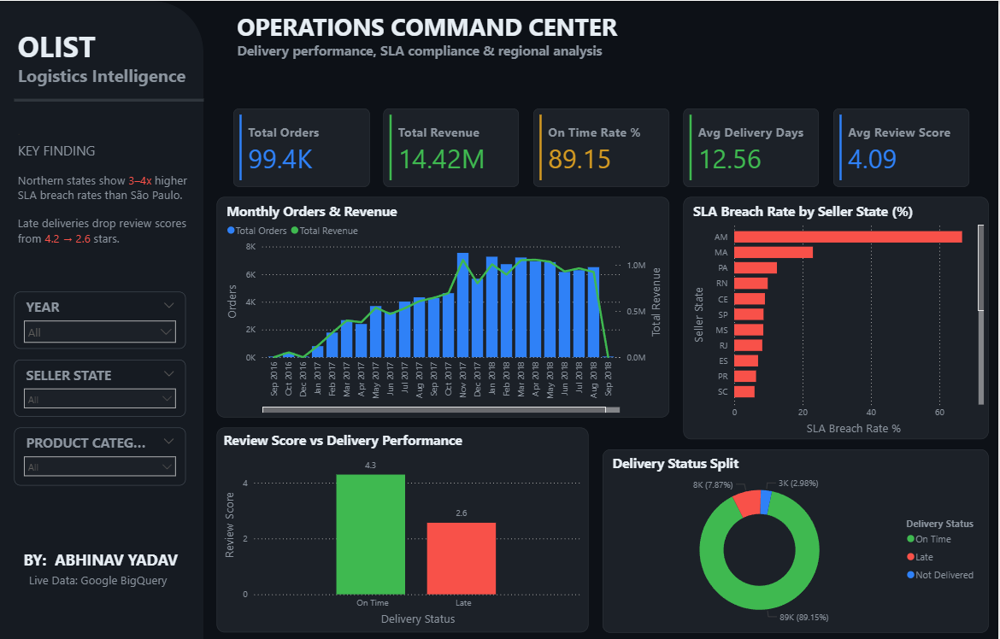

# Olist Logistics Intelligence Warehouse

A production-grade Medallion SQL Data Warehouse built on **100,000+ 
real Brazilian e-commerce orders** from the Olist platform (2016–2018), 
migrated to **Google BigQuery** and visualized through a 
**live Power BI dashboard**.

This project focuses entirely on **logistics and supply chain 
performance** — not retail sales. Key business questions answered:

- Which seller states breach SLAs most?
- Does late delivery reduce customer ratings?
- Which regions experience the longest delivery timelines?
- How do freight costs vary across product categories?
- Which sellers outperform peers operationally?

---

## 📊 Live Dashboard

Interactive 2-page Power BI dashboard connected to Google BigQuery 
as a live cloud data source.

 

**Page 1 — Operations Command Center**
99,441 orders analyzed across Brazil (2016–2018). 89% delivered 
on time — but late deliveries cost 1.6 review points on average, 
directly impacting seller reputation and repeat purchase rates.

**Page 2 — Seller & Product Intelligence**
Health & Beauty and Watches lead platform GMV. Heavy categories 
absorb freight costs at 30–50% of product value — compressing 
seller margins and creating cart abandonment risk at checkout.

---

## ☁️ Cloud Infrastructure — Google BigQuery

The complete Gold-layer analytics stack is deployed on 
**Google BigQuery** for cloud-based querying.

**Project:** `olist-logistics-warehouse`
**Dataset:** `olist_gold`
**Tables:** fact_logistics, dim_customers, dim_sellers, 
            dim_products, dim_date
**Views:** vw_seller_scorecard, vw_monthly_kpis, 
           vw_fact_analytics

All BigQuery-compatible SQL files are in the `/bigquery` folder.

---

## Project Highlights

- Built a **Bronze → Silver → Gold Medallion warehouse** in PostgreSQL
- **Migrated Gold layer to Google BigQuery** for cloud deployment
- Designed an **analytics-ready Star Schema** 
  (4 dimensions + 1 fact table)
- Processed **100K+ real e-commerce logistics records**
- Developed **15 advanced SQL analyses** using window functions, 
  CTEs, ranking, rolling averages, and SLA analytics — 
  re-executed on BigQuery cloud infrastructure
- Built **2-page Power BI dashboard** connected to BigQuery 
  as live data source with sidebar navigation, slicers, 
  and key finding callouts
- Created reusable reporting views for **seller performance** 
  and **monthly logistics KPIs**

---

## Full Stack

| Layer | Tool |
|---|---|
| Raw Data | Kaggle — Olist Brazilian E-Commerce Dataset |
| Ingestion | PostgreSQL COPY command |
| Transformation | Bronze → Silver → Gold (Medallion Architecture) |
| Cloud Warehouse | Google BigQuery |
| BI & Visualization | Power BI (DirectQuery — live BigQuery connection) |
| Version Control | GitHub |

---

## Architecture — Medallion (Bronze → Silver → Gold)

```text
RAW CSV FILES (9 datasets, 100K+ records)
            ↓
      BRONZE LAYER
Raw data loaded as-is. Timestamps stored as VARCHAR.
            ↓
       SILVER LAYER
Cleaned and typed data. VARCHAR → TIMESTAMP casts,
NULL handling, city/state standardization,
Portuguese → English category translation,
payments collapsed to one row per order.
            ↓
        GOLD LAYER
Analytics-ready Star Schema.
4 dimension tables + 1 central fact table with
computed logistics metrics and SLA flags.
            ↓
   GOOGLE BIGQUERY (CLOUD)
Gold layer migrated to BigQuery.
Done EDA and calculated advanced analytical insights
vw_fact_analytics view with pre-computed columns
for DirectQuery compatibility.
            ↓
      POWER BI DASHBOARD
Live 2-page dashboard connected to BigQuery.
Operations Command Center + Seller Intelligence.
```

---

## Star Schema Design


**`gold.fact_logistics`** is the central fact table.

Each row represents one order with computed logistics metrics:

- `approval_hours` → time from purchase to order approval
- `dispatch_days` → time from approval to courier pickup
- `transit_days` → time spent in transit
- `total_delivery_days` → end-to-end purchase to doorstep
- `promised_delivery_days` → expected customer delivery time
- `delivery_status` → On Time / Late / Not Delivered

---

## Dataset

**Source:** Olist Brazilian E-Commerce Public Dataset (Kaggle)
https://www.kaggle.com/datasets/olistbr/brazilian-ecommerce

| File | Rows | Description |
|---|---|---|
| olist_orders_dataset.csv | 99,441 | Core order records |
| olist_order_items_dataset.csv | 112,650 | Items per order |
| olist_customers_dataset.csv | 99,441 | Customer details |
| olist_sellers_dataset.csv | 3,095 | Seller details |
| olist_products_dataset.csv | 32,951 | Product catalog |
| olist_order_payments_dataset.csv | 103,886 | Payment records |
| olist_order_reviews_dataset.csv | 99,224 | Customer reviews |
| product_category_name_translation.csv | 71 | Portuguese → English |

---

## SQL Concepts Demonstrated

| Concept | Used In |
|---|---|
| Medallion Architecture | Scripts 01–03 |
| Star Schema Design | Script 03 |
| Window Functions — LAG() | Script 05 Query 1 |
| Window Functions — SUM() OVER() | Scripts 04, 05 |
| Window Functions — DENSE_RANK() | Script 05 Query 4 |
| Rolling Average — AVG() OVER() | Script 05 Query 9 |
| CTEs (WITH) | Script 05 |
| CASE Segmentation | Scripts 03, 05 |
| SQL Views | Script 06 |
| BigQuery Standard SQL | /bigquery folder |
| FORMAT_DATE() | BigQuery scripts |
| CREATE OR REPLACE VIEW | BigQuery scripts |

---

## Key Business Findings

**SLA Performance**
~89% of orders delivered on time. Northern states (AM, RR, AP) 
showed breach rates 3–4x higher than São Paulo.

**Late Delivery Impact**
Late deliveries averaged 2.6 stars vs 4.2 stars on-time — 
a 35% drop in customer satisfaction.

**Seller Performance Gap**
On-time rate varied by up to 35 percentage points between 
top and bottom sellers within the same state.

**Customer Retention**
~97% of customers placed only one order — significant 
repeat-order challenge.

**Freight Economics**
Heavy categories carried freight costs equal to 30–50% 
of product value.

**Platform Growth**
GMV grew ~3x between Q1 2017 and Q2 2018.

---

## Project Structure

```text
olist-logistics-sql-warehouse/
│
├── README.md
├── .gitignore
├── LICENSE
├── scripts/
│   ├── 01_bronze_load.sql                   <--  Original messy data
│   ├── 02_silver_clean.sql                  <--  Cleaned data
│   ├── 03_gold_schema.sql                   <--  Created fact and dim tables 
│   ├── 04_eda.sql                           <--  5 EDA queries
│   ├── 05_advanced_analytics.sql            <--  10 analytical queries generating insights
│   └── 06_views_reports.sql                 <--  Created report of sellers and products
│
├── dashboard/
│   ├── Olist_Logistic_Dashboard.pbix
│   ├── Page_1.png
│   ├── Page_2.png
│   └── olist_theme.json                      <-- Color pallet used in dashboard
│
├── bigquery/
│   ├── 01_eda_bigquery.sql
│   ├── 02_advanced_bigquery.sql
│   ├── 03_views_bigquery.sql
│   └── screenshots/
│       ├── sla_breach_by_state.png
│       ├── seller_ranking.png
│       ├── mom_growth.png
│       └── review_vs_delivery.png
│
└── assets/
    └── Schema_Diagram.png
```

---

## How to Run Locally

**Prerequisites:** PostgreSQL 14+, pgAdmin 4

```sql
CREATE DATABASE olist_warehouse;
```

Run scripts in order: 01 → 02 → 03 → 04 → 05 → 06

Update file paths in `01_bronze_load.sql` to match your machine.

---

## Tools & Stack

PostgreSQL 16 • SQL • Google BigQuery • Power BI (DirectQuery) • 
pgAdmin 4 • Python (EDA) • Git/GitHub

---

## License

This project is licensed under the **MIT License**.
